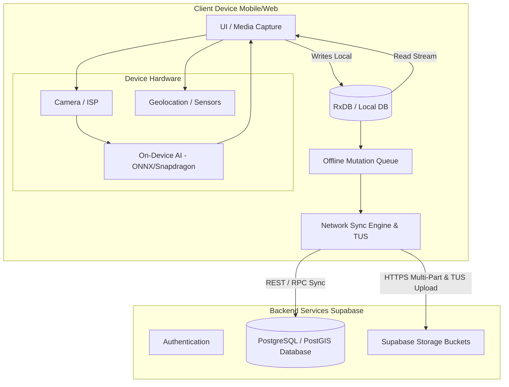

# Eon Base Project: Technical Architecture and Design Specifications

## 1. Proposed System Architecture

The Eon platform adopts a modern, scalable, and modular client-server architecture, initially developed as a mobile-first web application with a clear trajectory toward a native Android application optimized for Qualcomm Snapdragon hardware. Remote field discovery requires a **Local-First, Optimistic-Replication** pattern. The application treats local device storage as the primary source of truth during field operations, treating Supabase as a background replication target.

### High-Level Components

*   **Client / Frontend (Mobile-First Web & Future Native App)**
    *   **Core Framework:** React 18 with Vite, TypeScript.
    *   **Styling & UI:** TailwindCSS, shadcn/ui, Framer Motion for gamified animations.
    *   **Mapping Interface:** Interactive social and geological map integration (e.g., Leaflet or Mapbox) with offline vector tile packaging (MBTiles).
    *   **Local Storage Layer:** Offline-first sync layer using **RxDB** or **WatermelonDB** on top of SQLite/IndexedDB, featuring an Offline Mutation Queue.
    *   **Device APIs (Hardware Access):**
        *   **Camera/ISP:** High-resolution image capture for finding identification.
        *   **Sensors:** GPS, compass, and real-time geospatial data tracking.
        *   **Audio/Microphone:** Voice input for real-time AI consultations.
    *   **On-Device Processing:** Local inference for the AI Assistant and computer vision tasks (ONNX Runtime Web initially, migrating to Qualcomm NPU SDK natively) to reduce latency and enable offline field use.

*   **Backend Services (Supabase)**
    *   **Database (PostgreSQL with PostGIS):** Relational data storage for user profiles, geological records, finding metadata, and community map points. Features location fuzzing for anti-looting security.
    *   **Authentication:** Role-based access control (Standard Scouts vs. Level 5 Accredited Experts).
    *   **Storage:** Secure cloud storage for the Private Digital Gallery, utilizing TUS (Resumable Upload Protocol) for robust media syncing.

*   **AI Engine & Processing**
    *   **Conversational & Scientific Guide:** Large Language Model (LLM) fine-tuned with a "Master Geologist/Paleontologist" prompt.
    *   **Computer Vision:** Image recognition models for mineral and fossil identification.

*   **Specialized Modules**
    *   **Capture Buffer:** Rapid Photo Buffer / Burst Capture or short manual clips for the PWA MVP, evolving into a native hardware-accelerated continuous loop recording buffer.
    *   **Learning Progression Engine:** An invisible backend tracking system that monitors user interactions to progress them through Levels 1-4 and prepare them for Level 5 accreditation.

---

## 2. Infrastructure Diagram

### Core Sync & Client-Server Architecture



### Hardware & AI Pipeline Optimization

```text
                  ┌──────────────────────────────────────────────────┐
                  │                 Field User Input                 │
                  └────────────────────────┬─────────────────────────┘
                                           │
                                           ▼
                  ┌──────────────────────────────────────────────────┐
                  │            Network Connection Check              │
                  └───────┬──────────────────────────────────┬───────┘
                          │                                  │
                   [Online]                               [Offline]
                          │                                  │
                          ▼                                  ▼
   ┌──────────────────────────────────────────────┐ ┌──────────────────────────────────┐
   │ Cloud Pipeline                               │ │ Local Pipeline                   │
   │ • High-Res Image Upload                      │ │ • Light On-Device Quantized Model│
   │ • Vision Transformer (ViT) Classification    │ │   (MobileNet / ONNX Web Runtime) │
   │ • Multimodal LLM (GPT-4o/Claude) via Supabase│ │ • Heuristic Rule Engine          │
   └──────────────────────┬───────────────────────┘ └────────────────┬─────────────────┘
                          │                                  │
                          └──────────────────┬───────────────┘
                                             │
                                             ▼
                  ┌──────────────────────────────────────────────────┐
                  │ Structured JSON Response (Facts, Age, Taxonomy)  │
                  └──────────────────────────────────────────────────┘
```

---

## 3. User Workflow

The user journey is split into three main contexts: Field (Active Discovery), Home (Management & Community), and Education (Mentoring & Progression).

### Workflow A: The Field Discovery (Active Use - Offline First)
1.  **Preparation:** User opens the app and accesses the **Interactive Map**. Offline MBTiles have been pre-cached for the target expedition area.
2.  **Exploration & Capture:** User finds an interesting mineral or fossil. In the MVP PWA, they use the **Rapid Photo Buffer / Short Manual Clip** feature to capture the discovery.
3.  **Local AI Consultation:**
    *   User queries the AI Assistant.
    *   If offline, the **Local Pipeline (ONNX Web Runtime)** provides immediate visual classification (e.g., distinguishing quartz from calcite).
4.  **Geolocation & Storage:** The app tags the finding with GPS coordinates and stores the data and media locally in **RxDB / IndexedDB**. A mutation task is added to the **Offline Mutation Queue**.
5.  **Background Sync:** Once network connectivity is restored, the **Sync Engine** initiates resumable TUS uploads for media and syncs the metadata to Supabase.

### Workflow B: Post-Expedition & Management (Home Use)
1.  **Cataloging:** User reviews their Private Digital Gallery, organizing high-value pieces. The Supabase PostGIS database fuzzes public location data to prevent looting while keeping exact coordinates secure.
2.  **Community Interaction:** User accesses the social map to discuss findings with other explorers.
3.  **Mentorship:** A Level 5 Expert reviews a public finding, validates the identification, and provides feedback.

### Workflow C: Institutional Collaboration
1.  **Donation:** User donates a significant piece to an allied museum.
2.  **Integration & Immortalization:** The museum displays the physical piece with a generated QR code linking to the user's original Eon platform discovery clip.

---

## 4. Detailed Design Specifications

### A. Data Schema & PostGIS Security Enhancements

To prevent poaching risks (e.g., revealing exact coordinates of fragile fossil beds), the database employs PostGIS for spatial data manipulation and location fuzzing.

```sql
-- Schema Refinement: Separate exact field location from public spatial data
CREATE EXTENSION IF NOT EXISTS postgis;

CREATE TABLE public.findings (
    id UUID PRIMARY KEY DEFAULT gen_random_uuid(),
    user_id UUID NOT NULL REFERENCES auth.users(id) ON DELETE CASCADE,
    title VARCHAR(255) NOT NULL,
    ai_classification JSONB DEFAULT '{}'::jsonb,

    -- Exact location (Restricted to owner & accredited Level 5 experts)
    exact_location GEOMETRY(Point, 4326) NOT NULL,

    -- Public blurred location (Generalized spatial point/polygon for public feed)
    public_fuzzed_location GEOMETRY(Point, 4326),

    is_public BOOLEAN DEFAULT false,
    created_at TIMESTAMPTZ DEFAULT NOW(),
    updated_at TIMESTAMPTZ DEFAULT NOW()
);

-- Trigger to automatically fuzz coordinates for public consumption (e.g., ~2km offset)
CREATE OR REPLACE FUNCTION fuzz_finding_location()
RETURNS TRIGGER AS $$
BEGIN
    NEW.public_fuzzed_location := ST_SetSRID(
        ST_MakePoint(
            ST_X(NEW.exact_location) + (random() - 0.5) * 0.02,
            ST_Y(NEW.exact_location) + (random() - 0.5) * 0.02
        ), 4326);
    RETURN NEW;
END;
$$ LANGUAGE plpgsql;

CREATE TRIGGER trg_fuzz_location
BEFORE INSERT OR UPDATE ON public.findings
FOR EACH ROW EXECUTE FUNCTION fuzz_finding_location();
```
*   **Row Level Security (RLS):** Standard users can only select the fuzzed coordinates of other users' findings, while Level 5 experts or the resource owner can query `exact_location`.

### B. Local-First Sync Data Models

To prevent upload failures over spotty connections, metadata and media binaries are decoupled.

```typescript
// Local RxDB/WatermelonDB Schema

interface LocalFinding {
  id: string;                      // Client-side generated UUIDv4
  user_id: string;
  title: string;
  notes: string;
  exact_location: {               // WGS 84 Point
    latitude: number;
    longitude: number;
    accuracy_meters: number;
    altitude: number | null;
  };
  ai_classification_draft?: Record<string, any>;
  media_ids: string[];             // Foreign keys to LocalMedia table
  sync_state: 'DRAFT' | 'QUEUED' | 'SYNCING' | 'SYNCED' | 'ERROR';
  sync_error?: string;
  created_at: string;             // ISO 8601 UTC timestamp
  updated_at: string;
}

interface LocalMedia {
  id: string;                      // UUIDv4
  finding_id: string;              // Belongs to LocalFinding
  file_type: 'IMAGE' | 'VIDEO_CLIP';
  local_uri: string;               // blob:// URL or native file system path
  mime_type: string;
  byte_size: number;
  remote_storage_path?: string;
  upload_progress: number;
  upload_offset_bytes: number;     // Resumable upload tracker (TUS protocol)
  sync_state: 'PENDING_UPLOAD' | 'UPLOADING' | 'UPLOADED' | 'FAILED';
  created_at: string;
}

interface SyncQueueItem {
  id: string;
  entity_type: 'FINDING' | 'MEDIA';
  entity_id: string;               // Local ID
  action: 'CREATE' | 'UPDATE' | 'DELETE';
  payload: Record<string, any>;    // Serialized entity data
  retry_count: number;
  max_retries: number;             // Default: 5
  last_attempt_at?: string;
  next_retry_at?: string;
  status: 'PENDING' | 'PROCESSING' | 'PAUSED_OFFLINE' | 'FAILED_FATAL';
}
```

### C. Sync Engine State Machine

The client sync pipeline utilizes a Finite State Machine (FSM). Media files are uploaded via the **TUS (Resumable Upload Protocol)** before PostgreSQL metadata commits, preventing dangling database references. Retries use exponential backoff with jitter.

```mermaid
stateDiagram-v2
    [*] --> Idle

    state Idle {
        <-- Check Network & Queue
    }

    Idle --> FieldOffline : Connection Lost / Airplane Mode
    Idle --> SyncingFinding : Connection Active & Queue Has Items

    state FieldOffline {
        [*] --> RecordLocalDb
        RecordLocalDb --> QueueMutation : Write Metadata & Media Reference
        QueueMutation --> FieldOffline : User continues capturing
    }

    FieldOffline --> SyncingMedia : Network Detected (Online Event)

    state SyncingMedia {
        [*] --> CheckPendingBlobs
        CheckPendingBlobs --> UploadChunkTUS : Media > 0
        UploadChunkTUS --> UploadChunkTUS : Transmit Next Bytes Buffer
        UploadChunkTUS --> MediaUploaded : TUS 204 Complete
        UploadChunkTUS --> PauseAndRetry : Socket Dropout / Timeout
        PauseAndRetry --> UploadChunkTUS : Retry with Exponential Backoff
    }

    SyncingMedia --> SyncingFinding : All Media Uploaded successfully

    state SyncingFinding {
        [*] --> PostGISWrite
        PostGISWrite --> VerifyRLS : Send payload to Supabase RPC / REST
        VerifyRLS --> MarkSynced : DB Insert Confirmed
        VerifyRLS --> HandleError : 4xx / 5xx Error
    }

    SyncingFinding --> Idle : Queue Empty
    SyncingFinding --> FatalError : Max Retries Exceeded / RLS Rejection

    state FatalError {
        [*] --> FlagRecordNeedsUserAttention
    }
```

### D. Temporary Loop Video (Evolution)
*   **MVP (PWA) Mitigation:** Due to mobile browser Web Media API limitations (thermal throttling, memory constraints), the MVP will implement a **Rapid Photo Buffer / Burst Capture** or manual short 30-second clips.
*   **Native Path:** The true continuous 10-minute 1080p loop buffer will be deferred to the native Android build, utilizing Qualcomm's hardware codecs (`MediaCodec` + `SurfaceTexture` on a ring-buffer file descriptor) for power efficiency.

### E. User Role & Progression System
*   **Technology:** Supabase Auth with custom user metadata.
*   **Roles:** `standard_scout` (Levels 1-4), `level_5_expert`.
*   **Progression Logic:** A background service evaluating user actions (e.g., +10 points for verified AI ID) to update the user's level invisibly.

### F. Edge Case & Conflict Resolution Protocols

#### Conflict Resolution (Last-Write-Wins with Field-Level Merging)

Because field discoveries are predominantly user-centric (a user updates their own findings), collision risk between multiple users on a single record is low. However, if edits occur on separate offline devices before syncing:

*   **Rule:** The system applies a **Field-Level Last-Write-Wins (LWW)** using the vector timestamp or ISO creation date.
*   **Exception:** Deleted items on the client marked offline insert a `deleted_at` soft-delete flag rather than hard-deleting locally, ensuring tombstone synchronization reaches Supabase correctly.

#### Network Dropouts & Retry Backoff Logic

Retries avoid hammering network interfaces during weak signal states using an exponential backoff formula with random jitter:

*   **Formula:** `Retry Delay = min(Max Delay, Base Delay * 2^retry_count) + jitter`
*   **Base Delay:** 2 seconds
*   **Max Delay:** 300 seconds (5 minutes)
*   **Jitter:** Uniform random variance between 0 and 1,000 ms

#### Low Battery / Low Power Mode Handling

The engine hooks into the Network Information API (`navigator.connection`) and Battery Status API (`navigator.getBattery()`) on supported platforms:

*   **On Cellular Save Data / Low Battery (<15%):** Pause automatically uploading `VIDEO_CLIP` media objects; sync `FINDING` text metadata and low-res image thumbnails only.
*   **On Unmetered Wi-Fi / Charging:** Flush high-resolution media queue completely in background threads.
